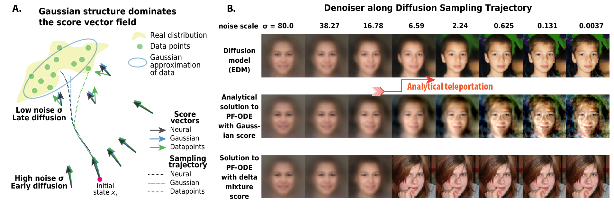

# Gaussian Teleportation Diffusion
---

Plug and play acceleration using analytical solution of diffusion model and image statistics. 




<details>
<summary>Mathematical Details</summary>

The Gaussian Teleportation Diffusion process leverages analytical solutions of diffusion models combined with image statistics. Here are the key mathematical components:
$$$$


</details>


## User Guide
### Code Demo 
```python
```

### Image Quality / Speed


### Pre-computed Image Statistics
We host the pre-computed mean and covariance matrices for common image datasets. 

* MNIST
* CIFAR10
* FFHQ64
* AFHQ64
* ImagNet64

### Run benchmark experiments yourself
```python

```

### Combined with `diffusers`

